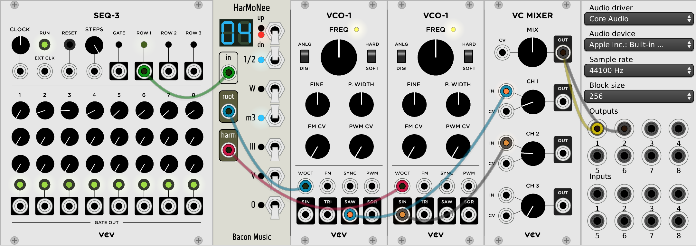
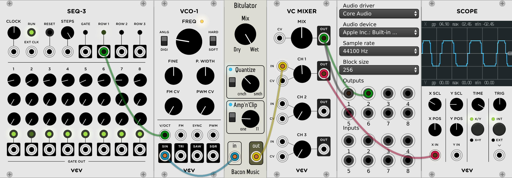

# BaconPlugs

BaconPlugs are my set of EuroRack style plugins for 
[VCVRack](http://www.vcvrack.com). The modules are mostly just me noodling around, but 
they sort of fall into two groups. One group deals with control voltage manipulation on 1v/oct signals
and does things like gliss and musical quantization. The other are wierdo distortions
and the like I am trying out.

All the source is here, released under an Apache 2.0 license. You are free to use
these modules as you see fit. If you happen to use them to make music, please
do let me know, either by raising an issue on this github or by tagging me on twitter (@baconpaul).

I build regularly on MacOS and check that the source builds on Linux from time to time.
All the sample patches that I use to test and make the screenshots here are
[available in the source distribution.](tree/master/patches) I will get around to a 
mac and linux binary distribution and push it to the community patch list soon. If you would
like to volunteer to build, test, and package them for windows, please raise a github issue and we
can figure out how to have that happen!

## HarMoNee

HarMoNee is a plugin which takes a 1v/oct CV signal and outputs two signals,
one which is the original, and the second which is modified by a musical amount,
like a minor 3rd. It spans plus or minus one octave, and is controlled by toggles.

The toggles are additive. So if you want a fourth, choose a major third and a half step 
both. You get the idea. 

## Glissinator

Glissinator takes a control voltage which is undergoing change and smooths out that
change with a linear glissando. It is not triggered by a gate, just by differences
in the input CV. It never jumps discontinously, so if the CV changes "target" value
mid-gliss, the whole thing turns around. The slider will give you between 0 and 1 seconds
of gliss time. Here's a sample patch.

## QuantEyes

QuantEyes takes a CV signal and clamps it to certain values 1/12 of a volt apart.
Functionally this means that CV signals which are changing on input will be clamped to
a chromatic scale on output if all the notes are activated. But you can also deactivate
certain notes to allow you to pick scales to which you quantize.

Since quantizing to scales could be useful for multiple things driving oscillators, 
you can apply this quantization to up to 3 inputs using the same scale.

Finally, you can choose where the "root" note is in CV space. The default is that
1 volt is the "R" note, but if you set root to 3, then 1 3/12 volts would be R. If you don't
understand this, send in a changing signal, select only the R note in the set of LED buttons, 
and then twiddle the root note.

Here's a (pretty cool sounding, I think) patch which combines QuantEyes with the 
Glissinator and Harmonee modules.

## ALingADing 

ALingADing is a simulation of a Ring Modulator based on [this paper by Julian Parker](http://recherche.ircam.fr/pub/dafx11/Papers/66_e.pdf) and
then taking some shortcuts.
Rather than following Parker's use of a few polynomials to simulate his diode, 
I basically use an implementaion of a softmax, eyeballing the parameters to roughly meet the figure in his
paper. The only control is a wet/dry mix (where wet is the signal modulated by carrier
and dry is just the signal). Sloppy, sure, but it sounds kinda cool. Here's a sample patch.

## Bitulator

Bitulator is really just me screwing around with some math on the input. It has two
functions. Firstly, it "quantizes" to a smaller number of "bits", but does it in a
wierd and sloppy way of basically making sure there are only N values possible in the 
output. Apply this to a sine wave with a low value of N and you get sort of stacked squares. 
Secondly it has a gross digital clipping amplifier. Basically signal is the clamp of input times
param. Apply this to a sine wave and turn it up and you get pretty much a perfect square.
Combine them for grunky grunk noise. Dumb, but fun. Here's a sample patch.

## License

Copyright © 2017  Paul Walker

Licensed under the Apache License, Version 2.0 (the "License");
you may not use this file except in compliance with the License.
You may obtain a copy of the License at

http://www.apache.org/licenses/LICENSE-2.0

Unless required by applicable law or agreed to in writing, software
distributed under the License is distributed on an "AS IS" BASIS,
WITHOUT WARRANTIES OR CONDITIONS OF ANY KIND, either express or implied.
See the License for the specific language governing permissions and
limitations under the License.

